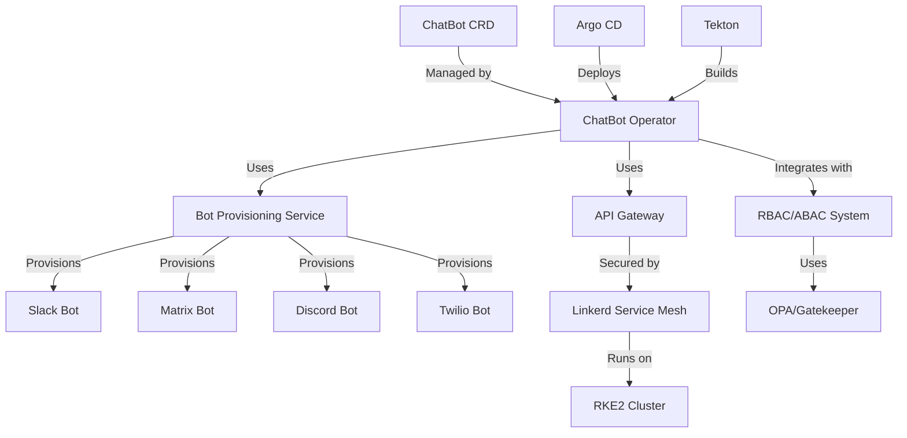
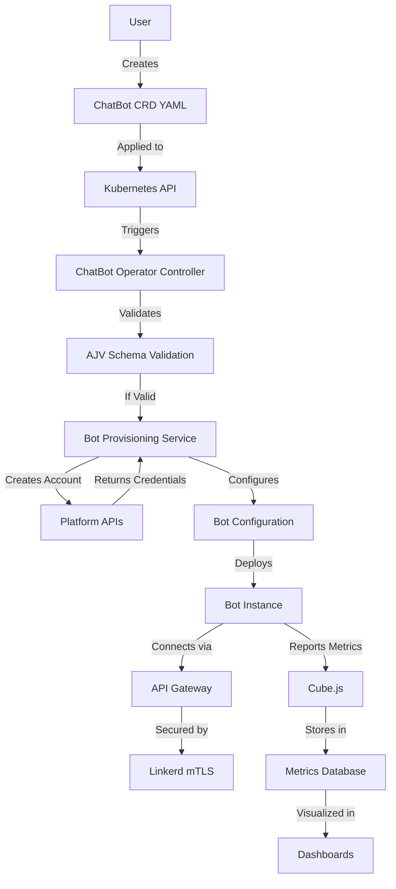

---
# Architecture Decision Records for ChatBot Operator
# References: docs/bmml/value-proposition.yaml (upstream)
# Downstream: docs/cubejs/metrics.yaml

title: ChatBot Operator Architecture Decisions
version: 1.0.0
created: 2024-12-19
author: Strategy Coder
references:
  upstream: docs/bmml/value-proposition.yaml
  downstream: docs/cubejs/metrics.yaml
---

# Architecture Decision Records

## ADR-001: Use Kubernetes Operator Pattern

**Status**: Accepted  
**Date**: 2024-12-19  
**Context**: Need to manage chat bot lifecycles as Kubernetes resources  
**Decision**: Implement as Kubernetes Operator using Kubebuilder framework  
**Consequences**: 
- ✅ Native Kubernetes integration
- ✅ Declarative management via CRDs
- ✅ Leverages Kubernetes ecosystem tools
- ⚠️ Requires Go language expertise
- ⚠️ Operator development complexity

**References**: 
- BMML Goal G001: Kubernetes CRD Development
- BMML Value Proposition VP001: Kubernetes Native Management

---

## ADR-002: Use Kubebuilder Framework

**Status**: Accepted  
**Date**: 2024-12-19  
**Context**: Need framework for building Kubernetes operators  
**Decision**: Use Kubebuilder (CNCF project) over Operator SDK  
**Consequences**: 
- ✅ CNCF project with strong community support
- ✅ Better integration with Kubernetes APIs
- ✅ Generates CRDs and controller scaffolding
- ✅ Used by major Kubernetes projects
- ⚠️ Steeper learning curve

**References**: 
- BMML Capability C002: Kubernetes Integration
- BMML Stakeholder S001: Platform Engineering Team requirements

---

## ADR-003: Multi-Platform Bot Support Architecture

**Status**: Accepted  
**Date**: 2024-12-19  
**Context**: Need to support Slack, Matrix, Discord, Twilio platforms  
**Decision**: Implement platform-specific provisioners with common interface  
**Consequences**: 
- ✅ Clean separation of platform-specific logic
- ✅ Easy to add new platforms
- ✅ Consistent API across all platforms
- ✅ Platform-specific error handling
- ⚠️ More complex initial implementation

**Architecture**:
```
┌─────────────────────────────────────┐
│         ChatBot Operator              │
│  ┌─────────────────────────────────┐│
│  │      Bot Provisioning Service    ││
│  │  ┌─────────────────────────────┐││
│  │  │    Platform Interface         │││
│  │  └─────────────────────────────┘││
│  │  ┌─────────┐ ┌─────────┐         ││
│  │  │ Slack    │ │ Matrix   │         ││
│  │  │ Prov.    │ │ Prov.    │         ││
│  │  └─────────┘ └─────────┘         ││
│  │  ┌─────────┐ ┌─────────┐         ││
│  │  │ Discord  │ │ Twilio   │         ││
│  │  │ Prov.    │ │ Prov.    │         ││
│  │  └─────────┘ └─────────┘         ││
│  └─────────────────────────────────┘│
└─────────────────────────────────────┘
```

**References**: 
- BMML Goal G001: Kubernetes CRD Development
- BMML Goal G002: Automated Bot Provisioning
- BMML Value Proposition VP002: Automated Bot Lifecycle

---

## ADR-004: Security Architecture with Linkerd

**Status**: Accepted  
**Date**: 2024-12-19  
**Context**: Need Zero Trust security for bot communications  
**Decision**: Use Linkerd service mesh for mutual TLS and security  
**Consequences**: 
- ✅ Automatic mutual TLS between services
- ✅ Service-to-service authentication
- ✅ Traffic encryption and policy enforcement
- ✅ Observability and metrics
- ✅ CNCF project with commercial support
- ⚠️ Additional infrastructure complexity

**Architecture**:
```
┌─────────────────────────────────────┐
│           RKE2 Cluster                │
│  ┌─────────────────────────────────┐│
│  │         Linkerd Service Mesh     ││
│  │  ┌─────────────────────────────┐││
│  │  │      ChatBot Operator         │││
│  │  │  ┌─────────────────────────┐│││
│  │  │  │    API Gateway            ││││
│  │  │  │  (mTLS termination)       ││││
│  │  │  └─────────────────────────┘│││
│  │  │  ┌─────────────────────────┐│││
│  │  │  │   Bot Provisioning        ││││
│  │  │  │      Service              ││││
│  │  │  └─────────────────────────┘│││
│  │  └─────────────────────────────┘││
│  └─────────────────────────────────┘│
└─────────────────────────────────────┘
```

**References**: 
- BMML Goal G004: Security by Design
- BMML Value Proposition VP003: Enterprise Security
- BMML Stakeholder S003: Security Team requirements

---

## ADR-005: RBAC/ABAC Integration Strategy

**Status**: Accepted  
**Date**: 2024-12-19  
**Context**: Need role-based and attribute-based access control  
**Decision**: Integrate with existing Kubernetes RBAC and implement ABAC via OPA/Gatekeeper  
**Consequences**: 
- ✅ Leverages existing Kubernetes RBAC
- ✅ Fine-grained access control with OPA
- ✅ Policy-as-code approach
- ✅ Audit trail and compliance
- ⚠️ Additional policy management overhead

**Architecture**:
```
┌─────────────────────────────────────┐
│         Access Control System         │
│  ┌─────────────────────────────────┐│
│  │      Kubernetes RBAC             ││
│  │  ┌─────────────────────────────┐││
│  │  │    Role-Based Access          │││
│  │  │    Control Rules              │││
│  │  └─────────────────────────────┘││
│  └─────────────────────────────────┘│
│  ┌─────────────────────────────────┐│
│  │         OPA/Gatekeeper            ││
│  │  ┌─────────────────────────────┐││
│  │  │   Attribute-Based Access       │││
│  │  │   Control Policies            │││
│  │  └─────────────────────────────┘││
│  └─────────────────────────────────┘│
└─────────────────────────────────────┘
```

**References**: 
- BMML Goal G003: Separation of Concerns
- BMML Business Service BS2: RBAC/ABAC Integration Service
- BMML Stakeholder S001: Platform Engineering Team requirements

---

## ADR-006: GitOps Workflow Implementation

**Status**: Accepted  
**Date**: 2024-12-19  
**Context**: Need consistent deployment and management workflow  
**Decision**: Implement GitOps with Argo CD for continuous delivery  
**Consequences**: 
- ✅ Declarative Git-based workflow
- ✅ Automated synchronization
- ✅ Audit trail and rollback capability
- ✅ Multi-environment support
- ✅ CNCF project with strong ecosystem
- ⚠️ Learning curve for GitOps patterns

**References**: 
- BMML Goal G005: Platform-Agnostic CI/CD
- BMML Process P002: Infrastructure Setup
- BMML Stakeholder S004: DevOps Team requirements

---

## ADR-007: Platform-Agnostic CI/CD Pipeline

**Status**: Accepted  
**Date**: 2024-12-19  
**Context**: Need CI/CD that works across GitLab, Forgejo, GitHub, Tekton, and local development  
**Decision**: Use Makefile as the single source of truth with platform-specific wrappers  
**Consequences**: 
- ✅ Single source of truth for all checks (Makefile)
- ✅ Platforms are just wrappers around Make targets
- ✅ Consistent behavior across all environments
- ✅ Easy to add new platforms
- ✅ Local development uses same targets as CI
- ✅ VSCode tasks, GitHub Actions, GitLab CI, Tekton all wrap the same Make targets
- ⚠️ Requires Make to be available in all environments

**Architecture**:
```
┌─────────────────────────────────────────────────────────────┐
│                    CI/CD Architecture                          │
│  ┌─────────────────────────────────────────────────────────┐│
│  │                    Makefile (Core)                         ││
│  │  ┌─────────────────────────────────────────────────────┐││
│  │  │  Actual Check Definitions:                            │││
│  │  │  - make deps        (install dependencies)             │││
│  │  │  - make lint        (linting)                          │││
│  │  │  - make test        (testing)                          │││
│  │  │  - make build       (building)                         │││
│  │  │  - make scan        (security scanning)                │││
│  │  │  - make sign        (artifact signing)                 │││
│  │  │  - make package     (packaging)                        │││
│  │  │  - make ci          (full pipeline)                    │││
│  │  └─────────────────────────────────────────────────────┘││
│  └─────────────────────────────────────────────────────────┘│
│                                                                  │
│  ┌─────────────────┐  ┌─────────────────┐  ┌─────────────┐│
│  │  GitHub Actions  │  │   GitLab CI     │  │   Tekton    ││
│  │  (Wrapper)       │  │   (Wrapper)     │  │  (Wrapper)   ││
│  └────────┬────────┘  └────────┬────────┘  └──────┬──────┘│
│           │                     │                  │        │
│           └─────────────────────┼──────────────────┘        │
│                             │                              │
│                    ┌────────────┴────────────┐             │
│                    │   VSCode Tasks           │             │
│                    │   (Wrapper)              │             │
│                    └──────────────────────────┘             │
│                    ┌──────────────────────────┐             │
│                    │   Local Development       │             │
│                    │   (make ci)              │             │
│                    └──────────────────────────┘             │
└─────────────────────────────────────────────────────────────┘
```

**Implementation Details**:

The Makefile contains the actual check definitions:
```
make deps        # Install dependencies
make lint        # Run linting
make test        # Run tests  
make build       # Build application
make scan        # Security scanning
make sign        # Sign artifacts
make package     # Package artifacts
make ci          # Full pipeline
```

Each platform wraps these targets:
- **GitHub Actions**: `.github/workflows/ci.yml` calls `make ci-lint`, `make ci-test`, etc.
- **GitLab CI**: `.gitlab-ci.yml` calls `make ci-lint`, `make ci-test`, etc.
- **Tekton**: `.tekton/pipeline.yaml` with tasks that call `make ci-lint`, `make ci-test`, etc.
- **VSCode**: `.vscode/tasks.json` with tasks that call `make ci-lint`, `make ci-test`, etc.
- **Local**: `make ci` runs the full pipeline

**Platform Detection**:
The Makefile detects the CI platform via environment variables:
- `CI_PLATFORM=github` (GitHub Actions)
- `CI_PLATFORM=gitlab` (GitLab CI)
- `CI_PLATFORM=tekton` (Tekton)
- `CI_PLATFORM=local` (default)

This allows the same Make targets to adapt their behavior based on the platform.

**References**: 
- BMML Developer Environment Goal DG001: Platform-Agnostic CI/CD
- BMML Metric M004: CI/CD Pipeline Success Rate
- BMML Stakeholder S004: DevOps Team requirements

---

## ADR-012: Makefile as Single Source of Truth for CI/CD

**Status**: Accepted  
**Date**: 2024-12-19  
**Context**: Need consistent CI/CD behavior across all platforms  
**Decision**: Makefile contains all actual check definitions, platforms are just wrappers  
**Consequences**: 
- ✅ Single source of truth for all checks
- ✅ Consistent behavior across platforms
- ✅ Easy to maintain and update
- ✅ Local development matches CI behavior
- ✅ Easy to add new platforms
- ✅ Platform-specific optimizations still possible
- ⚠️ Requires Make expertise

**Files**:
- `Makefile` - Core check definitions
- `.github/workflows/ci.yml` - GitHub Actions wrapper
- `.gitlab-ci.yml` - GitLab CI wrapper  
- `.tekton/pipeline.yaml` - Tekton wrapper
- `.tekton/tasks.yaml` - Tekton task definitions
- `.vscode/tasks.json` - VSCode task wrapper
- `scripts/ci/` - Platform-specific configurations

**Benefits**:
1. **Consistency**: All platforms run the exact same checks
2. **Maintainability**: Update once in Makefile, works everywhere
3. **Extensibility**: Easy to add new platforms by creating new wrappers
4. **Local Development**: Developers can run the same checks locally
5. **Debugging**: Issues found in CI can be reproduced locally with `make <target>`

---

## ADR-008: Business Metrics with Cube.js

**Status**: Accepted  
**Date**: 2024-12-19  
**Context**: Need business metrics and observability for bot operations  
**Decision**: Use Cube.js for business metrics as code  
**Consequences**: 
- ✅ Metrics defined as code
- ✅ SQL-based metric definitions
- ✅ Real-time dashboards
- ✅ API access to metrics
- ✅ Integration with existing data sources
- ⚠️ Additional infrastructure for Cube.js

**References**: 
- BMML Metrics: M001, M002, M003, M004
- BMML Value Proposition VP001: Kubernetes Native Management
- Downstream: docs/cubejs/metrics.yaml

---

## ADR-009: Documentation with React-Markdown and Mermaid

**Status**: Accepted  
**Date**: 2024-12-19  
**Context**: Need safe rendering of strategy metadata and diagrams  
**Decision**: Use react-markdown for markdown, gray-matter for frontmatter, Mermaid.js for diagrams  
**Consequences**: 
- ✅ Safe rendering of user content
- ✅ Support for YAML frontmatter
- ✅ Interactive diagrams
- ✅ React ecosystem integration
- ✅ Client-side rendering
- ⚠️ Additional frontend dependencies

**References**: 
- BMML Value Proposition VP001: Kubernetes Native Management
- Downstream: docs/diagrams.md

---

## ADR-010: Behavior-Driven Development with Godog

**Status**: Accepted  
**Date**: 2024-12-19  
**Context**: Need behavior-driven testing for bot provisioning workflows  
**Decision**: Use Godog (Gherkin in Go) for BDD testing  
**Consequences**: 
- ✅ Natural language test definitions
- ✅ Integration with Go ecosystem
- ✅ Behavior-driven development
- ✅ Living documentation
- ✅ Easy to understand for non-developers
- ⚠️ Additional test framework to learn

**References**: 
- BMML Process P001: Bot Lifecycle Management
- BMML Stakeholder S002: Application Development Team requirements
- Downstream: features/chatbot.feature

---

## ADR-011: JSON Schema Validation with AJV

**Status**: Accepted  
**Date**: 2024-12-19  
**Context**: Need fast JSON schema validation for CRDs and configurations  
**Decision**: Use AJV (Another JSON Schema Validator) for validation  
**Consequences**: 
- ✅ Fast validation performance
- ✅ Full JSON Schema support
- ✅ Small footprint
- ✅ JavaScript/TypeScript ecosystem
- ✅ Used by major projects
- ⚠️ Additional validation layer

**References**: 
- BMML Goal G001: Kubernetes CRD Development
- BMML Value Proposition VP001: Kubernetes Native Management
- Downstream: tests/schemas validation

---

## Technology Stack Summary

### Application Technologies (what the app uses)
| Component | Technology | Purpose | Reference |
|-----------|------------|---------|-----------|
| **Operator Framework** | Kubebuilder | Kubernetes operator development | ADR-002 |
| **Service Mesh** | Linkerd | Mutual TLS and service mesh | ADR-004 |
| **Policy Engine** | OPA/Gatekeeper | ABAC policies | ADR-005 |
| **Metrics** | Cube.js | Business metrics | ADR-008 |

### Developer Environment Technologies (how we build the app)
| Component | Technology | Purpose | Reference |
|-----------|------------|---------|-----------|
| **GitOps** | Argo CD | Continuous delivery | ADR-006 |
| **CI/CD** | Tekton | Pipeline automation | ADR-007 |
| **Documentation** | React-Markdown, Mermaid.js | Safe rendering | ADR-009 |
| **BDD Testing** | Godog | Behavior testing | ADR-010 |
| **Validation** | AJV | JSON schema validation | ADR-011 |

---

## Architecture Diagrams

### High-Level Architecture



### Data Flow Architecture



---

## Compliance and Standards

### CNCF Compliance
- ✅ Kubernetes (Container Orchestration)
- ✅ Linkerd (Service Mesh)
- ✅ Argo CD (GitOps)
- ✅ Tekton (CI/CD)
- ✅ OPA/Gatekeeper (Policy)

### SLSA Compliance
- **Level 3+**: Signed artifacts, hermetic builds, reproducible builds
- **Provenance**: Full build provenance tracking
- **Integrity**: Tamper-proof artifact verification

### Zero Trust Implementation
- ✅ Mutual TLS via Linkerd
- ✅ Service-to-service authentication
- ✅ Network policies and segmentation
- ✅ Continuous verification
- ✅ Least privilege access

---

## Next Steps

1. **Implement CRDs**: Define ChatBot, BotPlatform, BotConfiguration CRDs
2. **Develop Operator**: Build controller logic with Kubebuilder
3. **Create Provisioners**: Implement platform-specific bot provisioning
4. **Setup Security**: Configure Linkerd and RBAC/ABAC
5. **Build CI/CD**: Create Tekton pipelines and Argo CD applications
6. **Add Metrics**: Implement Cube.js metrics and dashboards
7. **Write Tests**: Develop Godog features and Jest/AJV tests