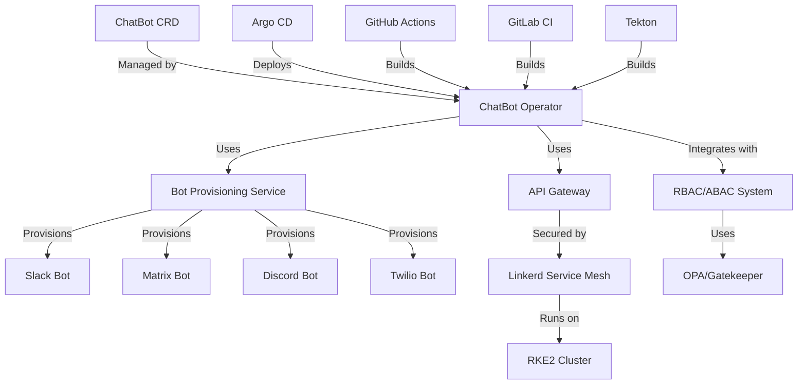
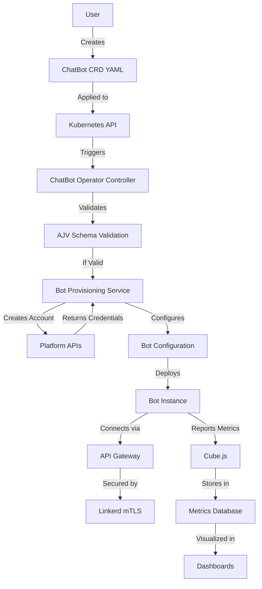

---
# Architecture Decision Records for ChatBot Operator
# References: ../../strategy/bmml/value-proposition.yaml (upstream)
# Downstream: ../../strategy/cubejs/metrics.yaml

title: ChatBot Operator Architecture Decisions
version: 0.1.0-dev
created: 2026-05-25
author: Strategy Coder
references:
  upstream: ../../strategy/bmml/value-proposition.yaml
  downstream: ../../strategy/cubejs/metrics.yaml
---

# Architecture Decision Records

## ADR-001: Use Kubernetes Operator Pattern

**Status**: Accepted  
**Date**: 2026-05-25  
**Context**: Need to manage chat bot lifecycles as Kubernetes resources  
**Decision**: Implement as Kubernetes Operator using Kubebuilder framework  
**Consequences**: 
- ✅ Native Kubernetes integration
- ✅ Declarative management via CRDs
- ✅ Leverages Kubernetes ecosystem tools
- ⚠️ Requires Go language expertise
- ⚠️ Operator development complexity

**References**: 
- BMML Goal G001: Kubernetes CRD Development
- BMML Value Proposition VP001: Kubernetes Native Management

---

## ADR-002: Use Kubebuilder Framework

**Status**: Accepted  
**Date**: 2026-05-25  
**Context**: Need framework for building Kubernetes operators  
**Decision**: Use Kubebuilder (CNCF project) over Operator SDK  
**Consequences**: 
- ✅ CNCF project with strong community support
- ✅ Better integration with Kubernetes APIs
- ✅ Generates CRDs and controller scaffolding
- ✅ Used by major Kubernetes projects
- ⚠️ Steeper learning curve

**References**: 
- BMML Capability C002: Kubernetes Integration
- BMML Stakeholder S001: Platform Engineering Team requirements

---

## ADR-003: Multi-Platform Bot Support Architecture

**Status**: Accepted  
**Date**: 2026-05-25  
**Context**: Need to support Slack, Matrix, Discord, Twilio platforms  
**Decision**: Implement platform-specific provisioners with common interface  
**Consequences**: 
- ✅ Clean separation of platform-specific logic
- ✅ Easy to add new platforms
- ✅ Consistent API across all platforms
- ✅ Platform-specific error handling
- ⚠️ More complex initial implementation

**Architecture**:
```
┌─────────────────────────────────────┐
│         ChatBot Operator              │
│  ┌─────────────────────────────────┐│
│  │      Bot Provisioning Service    ││
│  │  ┌─────────────────────────────┐││
│  │  │    Platform Interface         │││
│  │  └─────────────────────────────┘││
│  │  ┌─────────┐ ┌─────────┐         ││
│  │  │ Slack    │ │ Matrix   │         ││
│  │  │ Prov.    │ │ Prov.    │         ││
│  │  └─────────┘ └─────────┘         ││
│  │  ┌─────────┐ ┌─────────┐         ││
│  │  │ Discord  │ │ Twilio   │         ││
│  │  │ Prov.    │ │ Prov.    │         ││
│  │  └─────────┘ └─────────┘         ││
│  └─────────────────────────────────┘│
└─────────────────────────────────────┘
```

**References**: 
- BMML Goal G001: Kubernetes CRD Development
- BMML Goal G002: Automated Bot Provisioning
- BMML Value Proposition VP002: Automated Bot Lifecycle

---

## ADR-004: Security Architecture with Linkerd

**Status**: Accepted  
**Date**: 2026-05-25  
**Context**: Need Zero Trust security for bot communications  
**Decision**: Use Linkerd service mesh for mutual TLS and security  
**Consequences**: 
- ✅ Automatic mutual TLS between services
- ✅ Service-to-service authentication
- ✅ Traffic encryption and policy enforcement
- ✅ Observability and metrics
- ✅ CNCF project with commercial support
- ⚠️ Additional infrastructure complexity

**Architecture**:
```
┌─────────────────────────────────────┐
│           RKE2 Cluster                │
│  ┌─────────────────────────────────┐│
│  │         Linkerd Service Mesh     ││
│  │  ┌─────────────────────────────┐││
│  │  │      ChatBot Operator         │││
│  │  │  ┌─────────────────────────┐│││
│  │  │  │    API Gateway            ││││
│  │  │  │  (mTLS termination)       ││││
│  │  │  └─────────────────────────┘│││
│  │  │  ┌─────────────────────────┐│││
│  │  │  │   Bot Provisioning        ││││
│  │  │  │      Service              ││││
│  │  │  └─────────────────────────┘│││
│  │  └─────────────────────────────┘││
│  └─────────────────────────────────┘│
└─────────────────────────────────────┘
```

**References**: 
- BMML Goal G004: Security by Design
- BMML Value Proposition VP003: Enterprise Security
- BMML Stakeholder S003: Security Team requirements

---

## ADR-005: RBAC/ABAC Integration Strategy

**Status**: Accepted  
**Date**: 2026-05-25  
**Context**: Need role-based and attribute-based access control  
**Decision**: Integrate with existing Kubernetes RBAC and implement ABAC via OPA/Gatekeeper  
**Consequences**: 
- ✅ Leverages existing Kubernetes RBAC
- ✅ Fine-grained access control with OPA
- ✅ Policy-as-code approach
- ✅ Audit trail and compliance
- ⚠️ Additional policy management overhead

**Architecture**:
```
┌─────────────────────────────────────┐
│         Access Control System         │
│  ┌─────────────────────────────────┐│
│  │      Kubernetes RBAC             ││
│  │  ┌─────────────────────────────┐││
│  │  │    Role-Based Access          │││
│  │  │    Control Rules              │││
│  │  └─────────────────────────────┘││
│  └─────────────────────────────────┘│
│  ┌─────────────────────────────────┐│
│  │         OPA/Gatekeeper            ││
│  │  ┌─────────────────────────────┐││
│  │  │   Attribute-Based Access       │││
│  │  │   Control Policies            │││
│  │  └─────────────────────────────┘││
│  └─────────────────────────────────┘│
└─────────────────────────────────────┘
```

**References**: 
- BMML Goal G003: Separation of Concerns
- BMML Business Service BS2: RBAC/ABAC Integration Service
- BMML Stakeholder S001: Platform Engineering Team requirements

---

## ADR-006: GitOps Workflow Implementation

**Status**: Accepted  
**Date**: 2026-05-25  
**Context**: GitOps is a **design goal** for the project's development lifecycle, not an explicit architectural requirement of the application itself. The application enables GitOps patterns by being implemented as a Kubernetes CRD, allowing any GitOps tool (Argo CD, Fleet, Flux, etc.) to manage its lifecycle.

**Decision**: Use GitOps principles for the project's development workflow, with Argo CD and Fleet as example implementations. The ChatBot Operator CRD itself is GitOps-ready by design - it can be managed by any GitOps tool that supports Kubernetes resources.

**Consequences**: 
- ✅ Application is GitOps-ready by being a Kubernetes CRD
- ✅ Can be managed by Argo CD, Fleet, Flux, or any GitOps tool
- ✅ Declarative Git-based workflow for the project's development
- ✅ Automated synchronization capabilities
- ✅ Audit trail and rollback capability
- ✅ Multi-environment support
- ⚠️ Learning curve for GitOps patterns (mitigated by examples)

**Examples**:
- Argo CD Application manifests for ChatBot Operator
- Fleet Bundle configurations
- Flux HelmRelease or Kustomization resources

**References**: 
- BMML Goal G005: Platform-Agnostic CI/CD
- BMML Process P002: Infrastructure Setup
- BMML Stakeholder S004: DevOps Team requirements

---

## ADR-007: Platform-Agnostic CI/CD Pipeline

**Status**: Accepted  
**Date**: 2026-05-25  
**Context**: Need CI/CD that works across GitLab, Forgejo, GitHub, Tekton, and local development  
**Decision**: Use Makefile as the single source of truth with platform-specific wrappers  
**Consequences**: 
- ✅ Single source of truth for all checks (Makefile)
- ✅ Platforms are just wrappers around Make targets
- ✅ Consistent behavior across all environments
- ✅ Easy to add new platforms
- ✅ Local development uses same targets as CI
- ✅ VSCode tasks, GitHub Actions, GitLab CI, Tekton all wrap the same Make targets
- ⚠️ Requires Make to be available in all environments

**Architecture**:
```
┌─────────────────────────────────────────────────────────────┐
│                    CI/CD Architecture                          │
│  ┌─────────────────────────────────────────────────────────┐│
│  │                    Makefile (Core)                         ││
│  │  ┌─────────────────────────────────────────────────────┐││
│  │  │  Actual Check Definitions:                            │││
│  │  │  - make deps        (install dependencies)             │││
│  │  │  - make lint        (linting)                          │││
│  │  │  - make test        (testing)                          │││
│  │  │  - make build       (building)                         │││
│  │  │  - make scan        (security scanning)                │││
│  │  │  - make sign        (artifact signing)                 │││
│  │  │  - make package     (packaging)                        │││
│  │  │  - make ci          (full pipeline)                    │││
│  │  └─────────────────────────────────────────────────────┘││
│  └─────────────────────────────────────────────────────────┘│
│                                                                  │
│  ┌─────────────────┐  ┌─────────────────┐  ┌─────────────┐│
│  │  GitHub Actions  │  │   GitLab CI     │  │   Tekton    ││
│  │  (Wrapper)       │  │   (Wrapper)     │  │  (Wrapper)   ││
│  └────────┬────────┘  └────────┬────────┘  └──────┬──────┘│
│           │                     │                  │        │
│           └─────────────────────┼──────────────────┘        │
│                             │                              │
│                    ┌────────────┴────────────┐             │
│                    │   VSCode Tasks           │             │
│                    │   (Wrapper)              │             │
│                    └──────────────────────────┘             │
│                    ┌──────────────────────────┐             │
│                    │   Local Development       │             │
│                    │   (make ci)              │             │
│                    └──────────────────────────┘             │
└─────────────────────────────────────────────────────────────┘
```

**Implementation Details**:

The Makefile contains the actual check definitions:
```
make deps        # Install dependencies
make lint        # Run linting
make test        # Run tests  
make build       # Build application
make scan        # Security scanning
make sign        # Sign artifacts
make package     # Package artifacts
make ci          # Full pipeline
```

Each platform wraps these targets:
- **GitHub Actions**: `.github/workflows/ci.yml` calls `make ci-lint`, `make ci-test`, etc.
- **GitLab CI**: `.gitlab-ci.yml` calls `make ci-lint`, `make ci-test`, etc.
- **Tekton**: `.tekton/pipeline.yaml` with tasks that call `make ci-lint`, `make ci-test`, etc.
- **VSCode**: `.vscode/tasks.json` with tasks that call `make ci-lint`, `make ci-test`, etc.
- **Local**: `make ci` runs the full pipeline

**Platform Detection**:
The Makefile detects the CI platform via environment variables:
- `CI_PLATFORM=github` (GitHub Actions)
- `CI_PLATFORM=gitlab` (GitLab CI)
- `CI_PLATFORM=tekton` (Tekton)
- `CI_PLATFORM=local` (default)

This allows the same Make targets to adapt their behavior based on the platform.

**References**: 
- BMML Developer Environment Goal DG001: Platform-Agnostic CI/CD
- BMML Metric M004: CI/CD Pipeline Success Rate
- BMML Stakeholder S004: DevOps Team requirements

---

## ADR-012: Makefile as Single Source of Truth for CI/CD

**Status**: Accepted  
**Date**: 2026-05-25  
**Context**: Need consistent CI/CD behavior across all platforms  
**Decision**: Makefile contains all actual check definitions, platforms are just wrappers  
**Consequences**: 
- ✅ Single source of truth for all checks
- ✅ Consistent behavior across platforms
- ✅ Easy to maintain and update
- ✅ Local development matches CI behavior
- ✅ Easy to add new platforms
- ✅ Platform-specific optimizations still possible
- ⚠️ Requires Make expertise

**Files**:
- `Makefile` - Core check definitions
- `.github/workflows/ci.yml` - GitHub Actions wrapper
- `.gitlab-ci.yml` - GitLab CI wrapper  
- `.tekton/pipeline.yaml` - Tekton wrapper
- `.tekton/tasks.yaml` - Tekton task definitions
- `.vscode/tasks.json` - VSCode task wrapper
- `scripts/ci/` - Platform-specific configurations

**Benefits**:
1. **Consistency**: All platforms run the exact same checks
2. **Maintainability**: Update once in Makefile, works everywhere
3. **Extensibility**: Easy to add new platforms by creating new wrappers
4. **Local Development**: Developers can run the same checks locally
5. **Debugging**: Issues found in CI can be reproduced locally with `make <target>`

---

## ADR-008: Business Metrics with Cube.js

**Status**: Accepted  
**Date**: 2026-05-25  
**Context**: Need business metrics and observability for bot operations  
**Decision**: Use Cube.js for business metrics as code  
**Consequences**: 
- ✅ Metrics defined as code
- ✅ SQL-based metric definitions
- ✅ Real-time dashboards
- ✅ API access to metrics
- ✅ Integration with existing data sources
- ⚠️ Additional infrastructure for Cube.js

**References**: 
- BMML Metrics: M001, M002, M003, M004
- BMML Value Proposition VP001: Kubernetes Native Management
- Downstream: docs/cubejs/metrics.yaml

---

## ADR-009: Documentation with React-Markdown and Mermaid

**Status**: Accepted  
**Date**: 2026-05-25  
**Context**: Need safe rendering of strategy metadata and diagrams  
**Decision**: Use react-markdown for markdown, gray-matter for frontmatter, Mermaid.js for diagrams  
**Consequences**: 
- ✅ Safe rendering of user content
- ✅ Support for YAML frontmatter
- ✅ Interactive diagrams
- ✅ React ecosystem integration
- ✅ Client-side rendering
- ⚠️ Additional frontend dependencies

**References**: 
- BMML Value Proposition VP001: Kubernetes Native Management
- Downstream: docs/diagrams.md

---

## ADR-010: Behavior-Driven Development with Godog

**Status**: Accepted  
**Date**: 2026-05-25  
**Context**: Need behavior-driven testing for bot provisioning workflows  
**Decision**: Use Godog (Gherkin in Go) for BDD testing  
**Consequences**: 
- ✅ Natural language test definitions
- ✅ Integration with Go ecosystem
- ✅ Behavior-driven development
- ✅ Living documentation
- ✅ Easy to understand for non-developers
- ⚠️ Additional test framework to learn

**References**: 
- BMML Process P001: Bot Lifecycle Management
- BMML Stakeholder S002: Application Development Team requirements
- Downstream: features/chatbot.feature

---

## ADR-011: JSON Schema Validation with AJV

**Status**: Accepted  
**Date**: 2026-05-25  
**Context**: Need fast JSON schema validation for CRDs and configurations  
**Decision**: Use AJV (Another JSON Schema Validator) for validation  
**Consequences**: 
- ✅ Fast validation performance
- ✅ Full JSON Schema support
- ✅ Small footprint
- ✅ JavaScript ecosystem (for validation testing only, not application runtime)
- ✅ Used by major projects
- ⚠️ Additional validation layer

**References**: 
- BMML Goal G001: Kubernetes CRD Development
- BMML Value Proposition VP001: Kubernetes Native Management
- Downstream: tests/schemas validation

---

## Technology Stack Summary

### Application Technologies (what the app uses)
| Component | Technology | Purpose | Reference |
|-----------|------------|---------|-----------|
| **Operator Framework** | Kubebuilder | Kubernetes operator development | ADR-002 |
| **Service Mesh** | Linkerd | Mutual TLS and service mesh | ADR-004 |
| **Policy Engine** | OPA/Gatekeeper | ABAC policies | ADR-005 |
| **Metrics** | Cube.js | Business metrics | ADR-008 |

### Developer Environment Technologies (how we build the app)
| Component | Technology | Purpose | Reference |
|-----------|------------|---------|-----------|
| **GitOps** | Argo CD | Continuous delivery | ADR-006 |
| **CI/CD** | GitHub Actions, GitLab CI, Tekton | Pipeline automation | ADR-007 |
| **Documentation** | React-Markdown, Mermaid.js | Safe rendering | ADR-009 |
| **BDD Testing** | Godog | Behavior testing | ADR-010 |
| **Validation** | AJV | JSON schema validation (Node.js, testing only) | ADR-011 |

---

## Architecture Diagrams

### High-Level Architecture



### Data Flow Architecture



---

## Compliance and Standards

### CNCF Compliance
- ✅ Kubernetes (Container Orchestration)
- ✅ Linkerd (Service Mesh)
- ✅ Argo CD (GitOps)
- ✅ Tekton (CI/CD)
- ✅ OPA/Gatekeeper (Policy)

### SLSA Compliance
- **Level 3+**: Signed artifacts, hermetic builds, reproducible builds
- **Provenance**: Full build provenance tracking
- **Integrity**: Tamper-proof artifact verification

### Zero Trust Implementation
- ✅ Mutual TLS via Linkerd
- ✅ Service-to-service authentication
- ✅ Network policies and segmentation
- ✅ Continuous verification
- ✅ Least privilege access

---

## ADR-013: DevPod for Containerized Development Environment

**Status**: Accepted  
**Date**: 2026-05-25  
**Context**: Need reproducible development environment across different systems for consistent builds and testing  
**Decision**: Use DevPod (https://devpod.sh/) for containerized development environments  
**Consequences**: 
- ✅ Complete development environment with all tools pre-installed
- ✅ Works consistently across macOS, Linux, Windows
- ✅ Supports VSCode and JetBrains IDEs
- ✅ Easy to share and reproduce development setups
- ✅ Integrates with GitHub Codespaces and Gitpod
- ✅ Supports custom container images
- ⚠️ Requires Docker or Kubernetes for container runtime
- ⚠️ Initial setup complexity

**Architecture**:
```
┌─────────────────────────────────────────────────────────────┐
│                    DevPod Workspace                            │
│  ┌─────────────────────────────────────────────────────────┐│
│  │              Container (from Dockerfile)                   ││
│  │  ┌──────────┐ ┌──────────┐ ┌──────────┐ ┌────────────┐  ││
│  │  │   Go     │ │  Node.js  │ │  Make    │ │  kubectl   │  ││
│  │  │  1.21    │ │   20     │ │          │ │            │  ││
│  │  └──────────┘ └──────────┘ └──────────┘ └────────────┘  ││
│  │  ┌──────────┐ ┌──────────┐ ┌──────────┐ ┌────────────┐  ││
│  │  │kubebuild │ │golangci- │ │  Godog   │ │  cosign    │  ││
│  │  │          │ │  lint    │ │          │ │            │  ││
│  │  └──────────┘ └──────────┘ └──────────┘ └────────────┘  ││
│  │  ┌─────────────────────────────────────────────────────┐││
│  │  │              Mounted Workspace (/workspace)             │││
│  │  │  - Source code                                  │││
│  │  │  - Configuration files                          │││
│  │  │  - Git history                                  │││
│  │  └─────────────────────────────────────────────────────┘││
│  └─────────────────────────────────────────────────────────┘│
└─────────────────────────────────────────────────────────────┘
                    ▲
                    │
┌───────────────────┴───────────────────┐
│         DevPod CLI / IDE Extension        │
│  - Manages container lifecycle             │
│  - Handles port forwarding                  │
│  - Provides IDE integration                 │
└─────────────────────────────────────────┘
```

**Files Created**:
- `.devpod/devpod.yaml` - DevPod workspace configuration
- `.devpod/Dockerfile` - Multi-stage Docker build for development container
- Makefile targets: `devpod`, `devpod-start`, `devpod-stop`, `devpod-build`, `devpod-push`, `devpod-clean`

**References**: 
- Omen Strategy DG004: Containerized development environment
- ADR-012: Makefile as single source of truth

---

## ADR-014: Pre-push Hooks for Local Validation Gate

**Status**: Accepted  
**Date**: 2026-05-25  
**Context**: Need to ensure GitHub Actions will pass before pushing code, preventing broken builds  
**Decision**: Implement pre-push git hooks that run the same validations as GitHub Actions  
**Consequences**: 
- ✅ Catches issues before they reach remote
- ✅ Ensures local testing matches CI testing
- ✅ Prevents broken builds in GitHub Actions
- ✅ Provides immediate feedback to developers
- ✅ Reduces CI/CD resource usage
- ⚠️ Adds slight delay to push operations
- ⚠️ Requires hook setup on each development machine

**Implementation**:
- `scripts/validation/pre-push-hook.sh` - Main validation script
- `scripts/setup-git-hooks.sh` - Setup script for git hooks
- Validates: strategy chain, toolchain, dates, and runs tests
- Only runs on feature branches (vibe/*, ai-dev)
- Can be bypassed with `git push --no-verify`

**Files Created**:
- `scripts/validation/pre-push-hook.sh`
- `scripts/setup-git-hooks.sh`
- `.git/hooks/pre-push` (created by setup script)

**References**: 
- Omen Strategy DG005: Local testing as gate
- ADR-012: Makefile as single source of truth

---

## ADR-015: Vale with OpenSUSE Rules for Documentation Linting

**Status**: Accepted  
**Date**: 2026-05-25  
**Context**: Need consistent documentation style and correctness checking across all markdown, YAML, and JSON files  
**Decision**: Use Vale with OpenSUSE style guide as base, plus custom rules for project-specific requirements  
**Consequences**: 
- ✅ Consistent documentation style
- ✅ Catches spelling, grammar, and style issues
- ✅ Custom vocabulary for Kubernetes/Cloud Native terms
- ✅ Extensible with project-specific rules
- ✅ Integrates with CI/CD pipeline
- ⚠️ Requires Vale installation
- ⚠️ May have false positives that need tuning

**Implementation**:
- `.vale.ini` - Vale configuration file
- `.vale/styles/ChatBotOperator/` - Custom rules directory
- `scripts/setup-vale.sh` - Setup script to download OpenSUSE rules
- Makefile targets: `lint-vale`, `setup-vale`

**Custom Rules**:
- Check for hard references between documents
- Check for proper metadata in all files
- Custom vocabulary (Kubernetes, Kubebuilder, Linkerd, etc.)
- Reject deprecated terms (Java, Maven, Gradle, etc.)

**Files Created**:
- `.vale.ini`
- `.vale/styles/ChatBotOperator/References.vale`
- `scripts/setup-vale.sh`

**References**: 
- Omen Strategy DG006: Documentation correctness checking
- ADR-012: Makefile as single source of truth

---

## ADR-016: Stubbed GitLab and Tekton for Local Testing

**Status**: Accepted  
**Date**: 2026-05-25  
**Context**: Need to test CI/CD configurations locally without requiring GitLab or Tekton infrastructure  
**Decision**: Create stubbed versions of GitLab CI and Tekton manifests that can be validated locally  
**Consequences**: 
- ✅ Can test CI/CD configurations without external platforms
- ✅ Maintains platform-agnostic approach
- ✅ Allows local validation of pipeline structure
- ✅ Easy to upgrade to real platforms later
- ⚠️ Stubbed versions won't actually run without the platforms
- ⚠️ Need to maintain both stubbed and real versions

**Implementation**:
- `.gitlab-ci-stub.yml` - Stubbed GitLab CI configuration
- `.tekton/pipeline-stub.yaml` - Stubbed Tekton pipeline
- Updated Makefile to use stubbed versions for local testing
- Clear documentation that these are stubs

**Files Created**:
- `.gitlab-ci-stub.yml`
- `.tekton/pipeline-stub.yaml`

**References**: 
- Omen Strategy DG001: Platform-agnostic CI/CD
- ADR-012: Makefile as single source of truth

---

## ADR-017: Conventional Commits Validation

**Status**: Accepted  
**Date**: 2026-05-25  
**Context**: Need to enforce consistent commit message format across the project for better changelog generation and project history  
**Decision**: Implement Conventional Commits standard with commit-msg git hook and commitlint configuration  
**Consequences**: 
- ✅ Consistent commit message format
- ✅ Better changelog generation
- ✅ Easier project history navigation
- ✅ Integration with semantic versioning tools
- ✅ Clear commit intent (feat, fix, docs, etc.)
- ⚠️ Requires developer training on Conventional Commits
- ⚠️ Hook setup required on each development machine

**Implementation**:
- `.commitlintrc.js` - Commitlint configuration
- `scripts/validation/validate-commit-message.sh` - Validation script
- `scripts/setup-commit-hooks.sh` - Git hook setup script
- `.git/hooks/commit-msg` - Git hook (created by setup script)

**Conventional Commits Format**:
```
type(scope): subject

body

footer
```

**Valid Types**:
- `build`: Changes that affect the build system or external dependencies
- `chore`: Changes to the build process or auxiliary tools
- `ci`: Changes to CI configuration files and scripts
- `docs`: Documentation only changes
- `feat`: A new feature
- `fix`: A bug fix
- `perf`: A code change that improves performance
- `refactor`: A code change that neither fixes a bug nor adds a feature
- `revert`: Revert to a commit
- `style`: Changes that do not affect the meaning of the code
- `test`: Adding missing tests

**Files Created**:
- `.commitlintrc.js`
- `scripts/validation/validate-commit-message.sh`
- `scripts/setup-commit-hooks.sh`

**References**: 
- Omen Strategy C004: Follow Conventional Commit standard
- ADR-012: Makefile as single source of truth
- https://www.conventionalcommits.org/

---

## ADR-018: Secret Scanning with Gitleaks

**Status**: Accepted  
**Date**: 2026-05-25  
**Context**: Need to prevent accidental commitment of secrets (API keys, tokens, passwords) to the repository  
**Decision**: Use Gitleaks with custom configuration for ChatBot Operator-specific secret patterns  
**Consequences**: 
- ✅ Prevents secrets from being committed
- ✅ Custom patterns for all supported platforms (Slack, Matrix, Discord, Twilio, GitHub, etc.)
- ✅ Integrates with pre-push hooks
- ✅ Integrates with CI/CD pipeline
- ✅ Reduces security incidents
- ⚠️ May have false positives that need tuning
- ⚠️ Requires Gitleaks installation

**Implementation**:
- `.gitleaks.toml` - Custom Gitleaks configuration
- `scripts/validation/scan-secrets.sh` - Secret scanning script
- Integrated into pre-push hooks
- Integrated into CI/CD pipeline

**Custom Patterns Include**:
- GitHub tokens (ghp_, gho_, ghr_, ghs_, ghu_)
- GitLab tokens (glpat_)
- Slack tokens and webhooks
- Matrix tokens
- Discord tokens
- Twilio API keys and tokens
- AWS credentials
- Google API keys
- Azure credentials
- Stripe API keys
- SendGrid API keys
- Mailchimp API keys
- NPM tokens
- PyPI tokens
- Docker Hub tokens
- GitHub Container Registry tokens
- Private keys
- Bearer tokens
- JWT tokens
- Basic auth credentials
- Connection strings

**Files Created**:
- `.gitleaks.toml`
- `scripts/validation/scan-secrets.sh`

**References**: 
- Omen Strategy AG004: Secure by Design
- ADR-004: Security Architecture with Linkerd
- https://github.com/gitleaks/gitleaks

---

## ADR-019: CNCF Graduated Project Compliance Validation

**Status**: Accepted  
**Date**: 2026-05-25  
**Context**: Need to ensure the project follows CNCF graduated project guidelines for technical excellence  
**Decision**: Create automated validation script that checks compliance with CNCF best practices, ignoring organizational tasks  
**Consequences**: 
- ✅ Automated compliance checking
- ✅ Focus on technical requirements (security, quality, documentation, etc.)
- ✅ Clear guidance on what needs improvement
- ✅ Can be integrated into CI/CD pipeline
- ✅ Helps prepare for CNCF graduation
- ⚠️ Some checks are recommendations, not hard requirements
- ⚠️ Organizational tasks (governance, trademark) are ignored

**Implementation**:
- `scripts/validation/validate-cncf-compliance.sh` - Compliance validation script
- Makefile target: `test-cncf-compliance`
- Integrated into CI/CD pipeline

**Compliance Areas Checked**:
1. **Security Best Practices** (TAG-Security)
   - Security scanning in CI
   - Dependency scanning
   - Secret scanning
   - SBOM generation
   - Artifact signing

2. **Supply Chain Security** (SLSA)
   - Provenance generation
   - Hermetic builds

3. **Code Quality** (TAG-Quality)
   - Linting configured
   - Testing configured
   - Code coverage

4. **Documentation** (TAG-Documentation)
   - README.md exists
   - CONTRIBUTING.md exists
   - LICENSE file exists
   - Architecture documentation exists

5. **Kubernetes Best Practices** (TAG-Container, TAG-K8s)
   - Kubernetes manifests found
   - Kubebuilder configured
   - CRDs configured

6. **Observability** (TAG-Observability)
   - Metrics configured
   - Logging configured
   - Tracing (recommended)

7. **CI/CD Best Practices** (TAG-CI-Best-Practices)
   - GitHub Actions configured
   - Makefile exists
   - Platform-agnostic CI
   - Multiple CI platforms

8. **License Compliance** (TAG-Legal)
   - SPDX license identifier
   - Go module build constraints

9. **Security Policy** (TAG-Security)
   - SECURITY.md exists (recommended)
   - Security contacts documented

10. **Maintainability** (TAG-Maintainer)
    - MAINTAINERS/OWNERS file (recommended)
    - Governance documentation (recommended)
    - Roadmap (recommended)

**Files Created**:
- `scripts/validation/validate-cncf-compliance.sh`

**References**: 
- Omen Strategy AG004: Secure by Design
- ADR-004: Security Architecture with Linkerd
- https://github.com/cncf/tag-security
- https://github.com/cncf/cncf.github.io/tree/main/projects
- https://slsa.dev/

---

## Next Steps

1. **Implement CRDs**: Define ChatBot, BotPlatform, BotConfiguration CRDs
2. **Develop Operator**: Build controller logic with Kubebuilder
3. **Create Provisioners**: Implement platform-specific bot provisioning
4. **Setup Security**: Configure Linkerd and RBAC/ABAC
5. **Build CI/CD**: Create Tekton pipelines and Argo CD applications
6. **Add Metrics**: Implement Cube.js metrics and dashboards
7. **Write Tests**: Develop Godog features and Jest/AJV tests
8. **DevPod Integration**: Build and test DevPod container image
9. **Setup Git Hooks**: Run `scripts/setup-git-hooks.sh` on development machines
10. **Setup Vale**: Run `make setup-vale` to download OpenSUSE rules
11. **Setup Commit Hooks**: Run `scripts/setup-commit-hooks.sh` for Conventional Commits validation
12. **Scan for Secrets**: Run `make scan-secrets` to check for accidentally committed secrets
13. **Validate CNCF Compliance**: Run `make test-cncf-compliance` to check CNCF guidelines