---
# ChatBot Operator Architecture Diagrams
# References: docs/cubejs/metrics.yaml (upstream)
# Downstream: features/chatbot.feature

title: ChatBot Operator Architecture Diagrams
version: 0.1.0-dev
created: 2026-05-25
author: Strategy Coder
references:
  upstream: docs/cubejs/metrics.yaml
  downstream: features/chatbot.feature
rendering:
  engine: react-markdown + gray-matter + Mermaid.js
  safe: true
---

# ChatBot Operator Architecture Diagrams

This document contains the comprehensive architecture diagrams for the ChatBot Operator project. These diagrams are rendered safely using react-markdown for markdown content, gray-matter for YAML frontmatter parsing, and Mermaid.js for interactive diagrams.

## Table of Contents

1. [System Context Diagram](#system-context-diagram)
2. [High-Level Architecture](#high-level-architecture)
3. [Component Architecture](#component-architecture)
4. [Data Flow Architecture](#data-flow-architecture)
5. [Security Architecture](#security-architecture)
6. [Monitoring and Observability](#monitoring-and-observability)
7. [Platform Integration](#platform-integration)

---

## System Context Diagram

The system context diagram shows the ChatBot Operator in relation to its external dependencies and users. The operator listens for CRD changes and Kubernetes API extension calls - deployment and CI/CD configuration is out of scope.

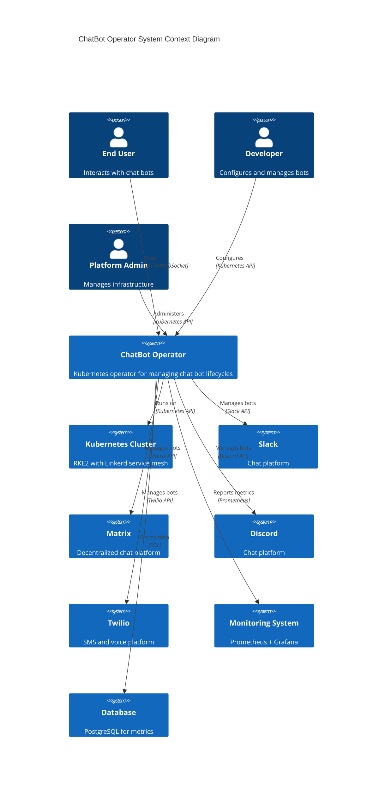

---

## High-Level Architecture

The high-level architecture shows the main components and their interactions.

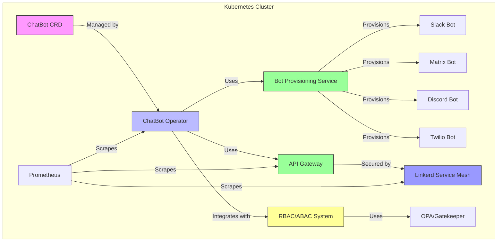

---

## Component Architecture

The component architecture shows the internal structure of the ChatBot Operator.

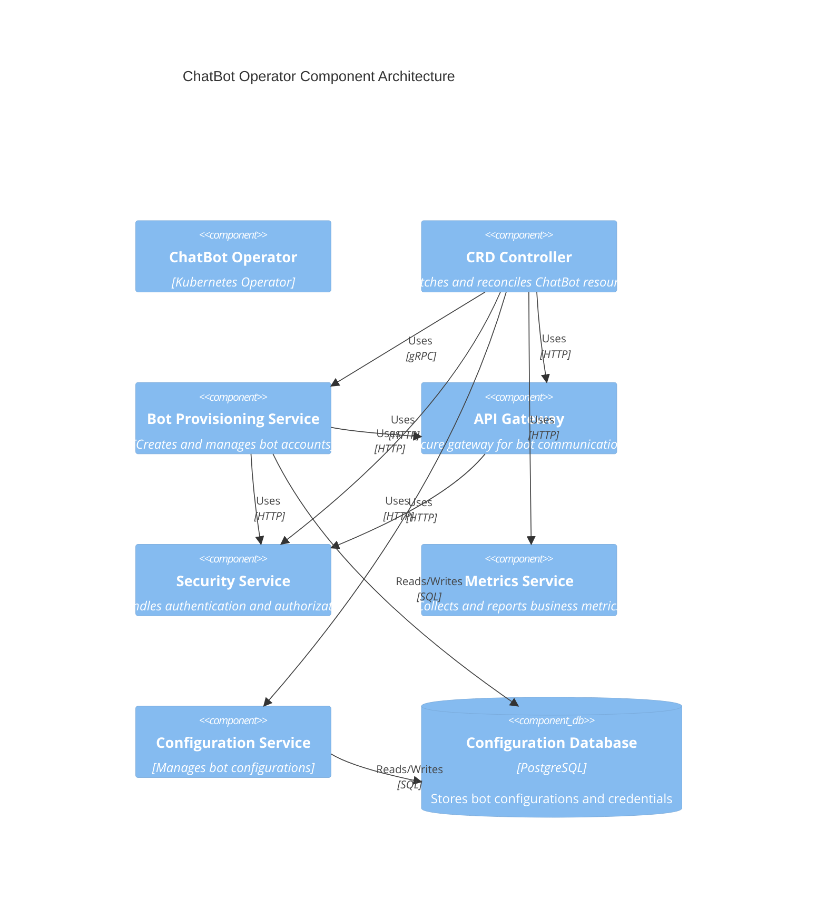

---

## Data Flow Architecture

The data flow architecture shows how data moves through the system.

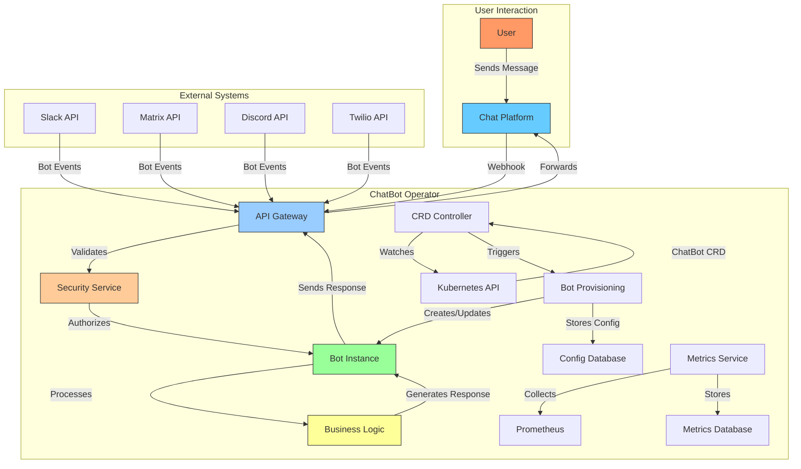

---

## Security Architecture

The security architecture shows the Zero Trust implementation with Linkerd and RBAC/ABAC.

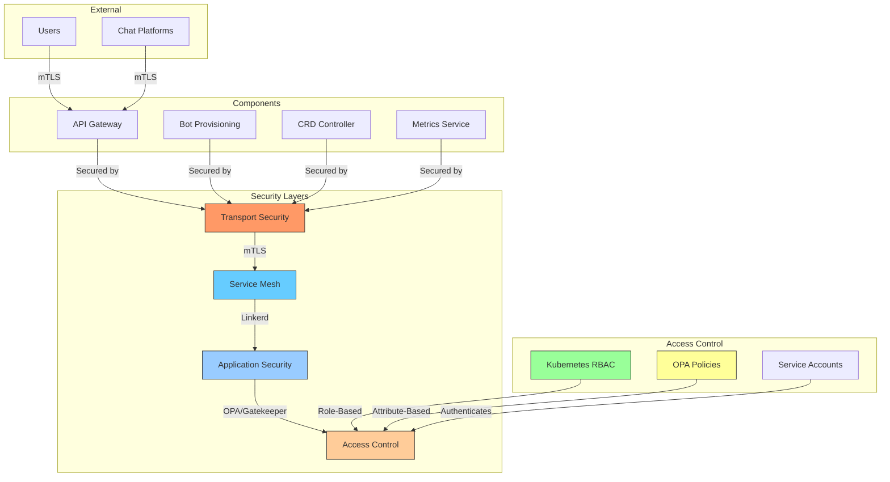

### Security Implementation Details

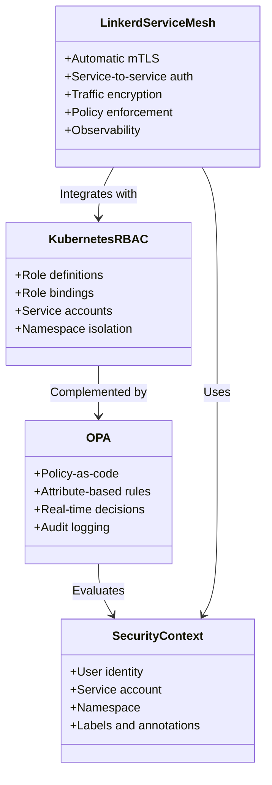

---

## Monitoring and Observability

The monitoring architecture shows how metrics, logs, and traces are collected and visualized.

```mermaid
flowchart TD
    subgraph Data Sources
        A[ChatBot Operator] -->|Metrics| B[Prometheus]
        C[API Gateway] -->|Metrics| B
        D[Linkerd] -->|Metrics| B
        E[Kubernetes] -->|Metrics| B
        
        A -->|Logs| F[Loki]
        C -->|Logs| F
        D -->|Logs| F
        E -->|Logs| F
        
        A -->|Traces| G[Jaeger]
        C -->|Traces| G
    end
    
    subgraph Processing
        B -->|Processes| H[Cube.js]
        F -->|Processes| I[Log Processing]
        G -->|Processes| J[Trace Processing]
    end
    
    subgraph Storage
        H -->|Stores| K[PostgreSQL]
        I -->|Stores| L[Object Storage]
        J -->|Stores| M[Trace Storage]
    end
    
    subgraph Visualization
        K -->|Queries| N[Grafana]
        H -->|Queries| N
        F -->|Queries| N
        G -->|Queries| N
        
        N -->|Displays| O[Dashboards]
        N -->|Alerts| P[Alert Manager]
    end
    
    subgraph Business Metrics
        H -->|Exposes| Q[Business Metrics API]
        Q -->|Consumed by| R[Custom Applications]
        Q -->|Consumed by| S[External Systems]
    end
    
    style B fill:#fc6,stroke:#333
    style F fill:#6cf,stroke:#333
    style G fill:#9cf,stroke:#333
    style N fill:#ff9,stroke:#333
    style H fill:#bbf,stroke:#333
```

---

## Platform Integration

The platform integration shows how different chat platforms are supported.

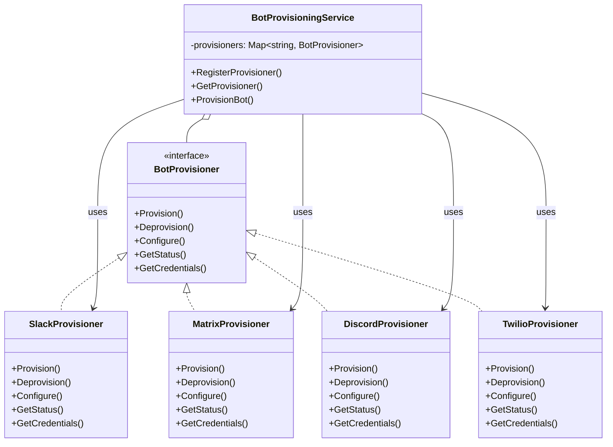

### Platform-Specific Architecture

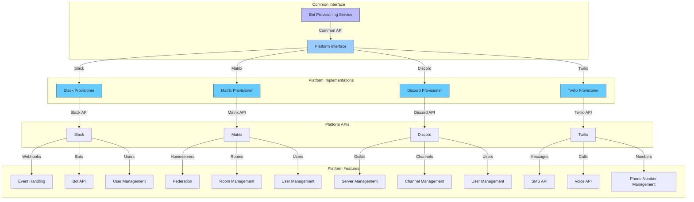

---

## Kubernetes CRD Definitions

The Custom Resource Definitions for the ChatBot Operator.

```mermaid
erDiagram
    ChatBot ||--o{ BotPlatform : "uses"
    ChatBot ||--o{ BotConfiguration : "has"
    ChatBot ||--o{ BotCredential : "has"
    
    ChatBot {
        string metadata.name PK
        string metadata.namespace
        string spec.platform
        string spec.team
        string spec.displayName
        string spec.description
        string spec.callbackURL
        string spec.webhookURL
        string status.phase
        string status.message
        datetime status.lastUpdated
    }
    
    BotPlatform {
        string metadata.name PK
        string spec.type "slack|matrix|discord|twilio"
        string spec.apiEndpoint
        string spec.apiVersion
        string spec.authenticationMethod
        string status.healthy
        string status.version
    }
    
    BotConfiguration {
        string metadata.name PK
        string spec.chatBotRef
        string spec.key
        string spec.value
        string spec.sensitive
        datetime spec.lastUpdated
    }
    
    BotCredential {
        string metadata.name PK
        string spec.chatBotRef
        string spec.type "apiToken|webhookSecret|certificate"
        string spec.valueEncrypted
        datetime spec.expiresAt
        datetime spec.lastRotated
    }
```

---

## Sequence Diagrams

### Bot Provisioning Sequence

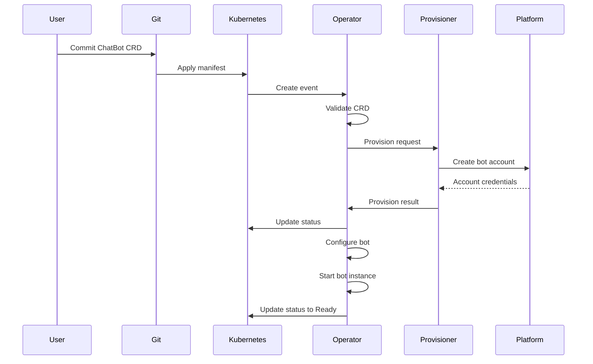

### Message Processing Sequence

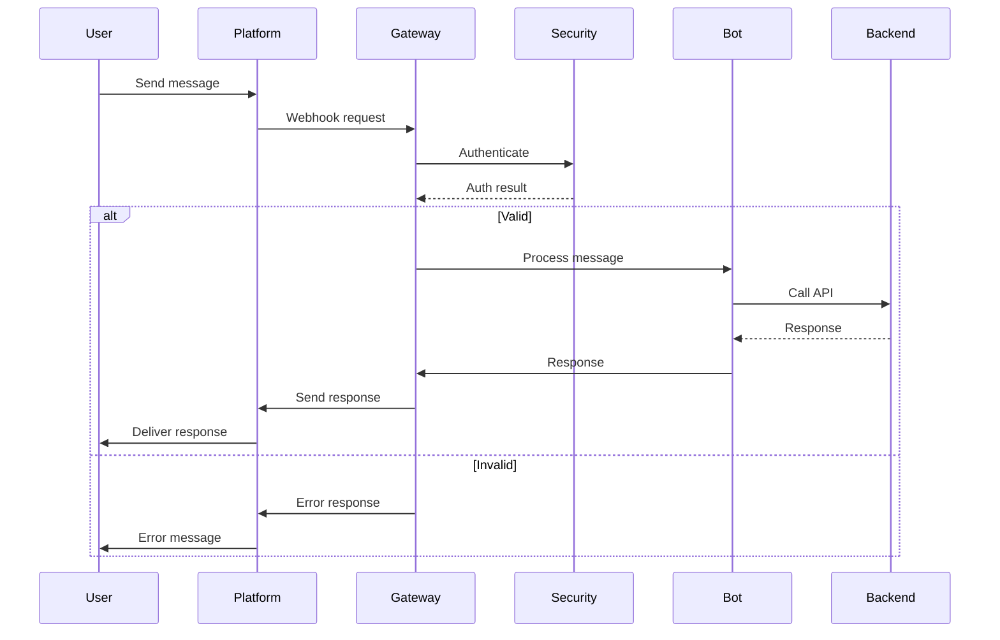

---

## State Machines

### Bot Lifecycle State Machine

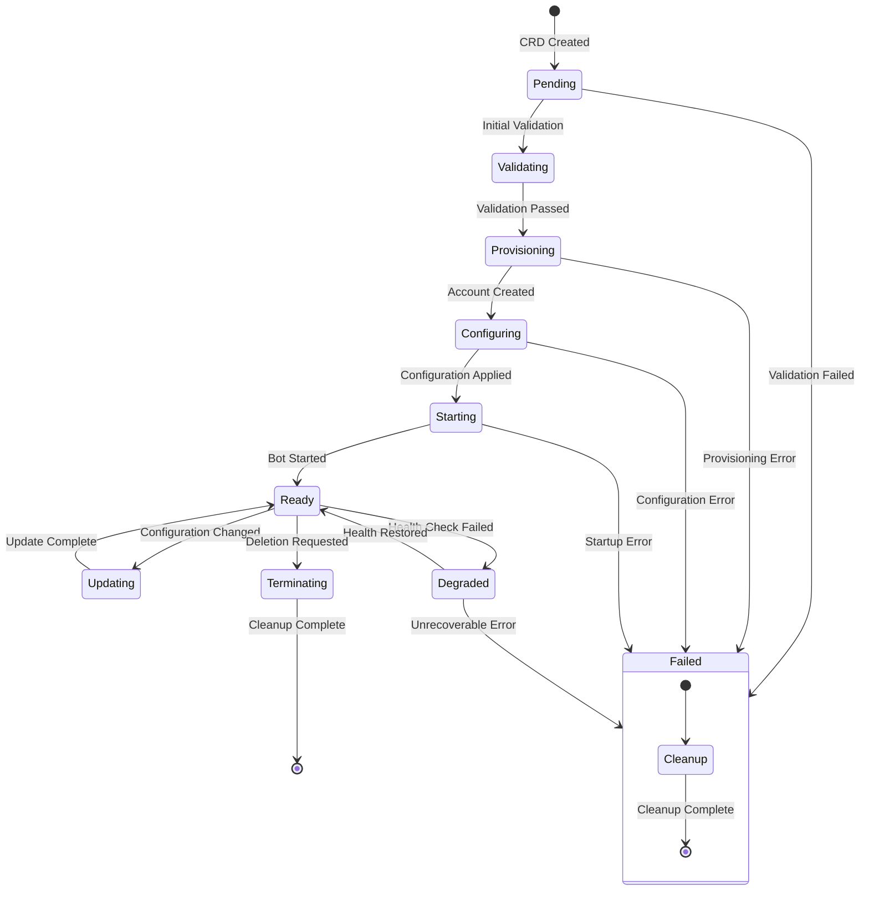

### Provisioning State Machine

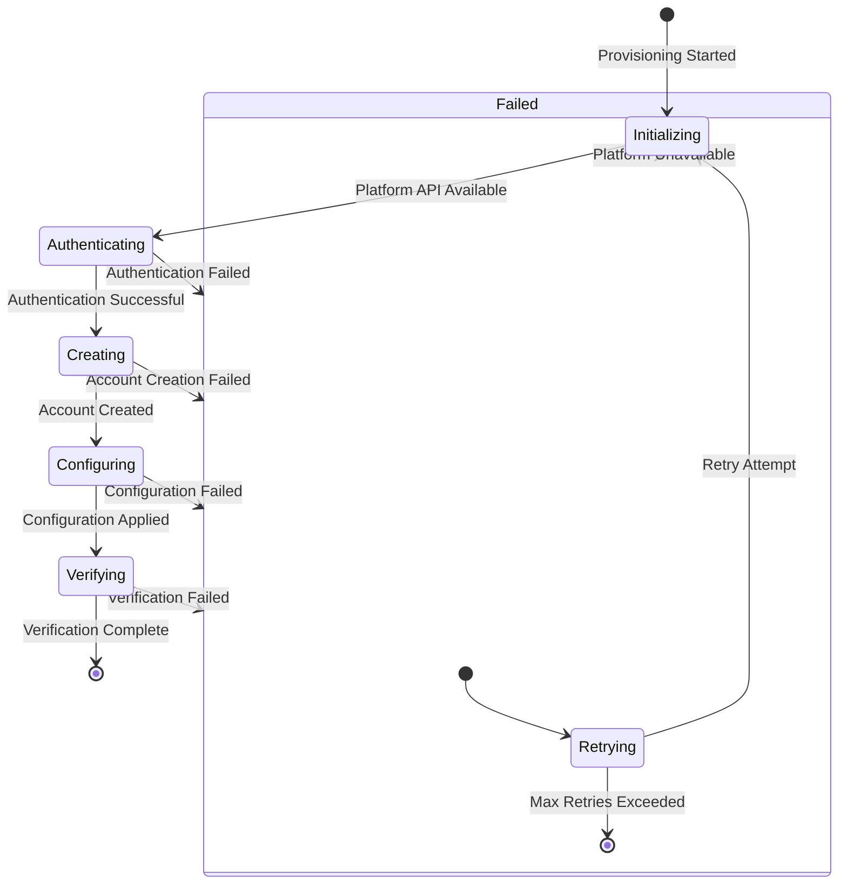

---

## Network Topology

The network topology shows how components communicate.

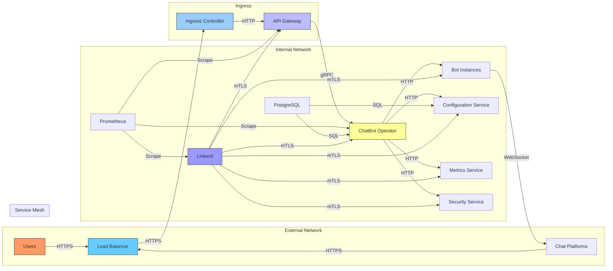

---

## Summary

This document provides a comprehensive set of architecture diagrams for the ChatBot Operator project. Each diagram illustrates different aspects of the system:

- **System Context**: Shows the big picture and external dependencies
- **High-Level Architecture**: Shows the main components and their relationships
- **Component Architecture**: Shows the internal structure of the operator
- **Data Flow**: Shows how data moves through the system
- **Security Architecture**: Shows the Zero Trust implementation
- **Monitoring**: Shows the observability stack
- **Platform Integration**: Shows how different chat platforms are supported
- **CRD Definitions**: Shows the Kubernetes resource definitions
- **Sequence Diagrams**: Shows the interaction sequences
- **State Machines**: Shows the lifecycle states
- **Network Topology**: Shows the network communication patterns

All diagrams are rendered safely using react-markdown, gray-matter, and Mermaid.js, ensuring that user content is properly sanitized and displayed.

**Next Steps**: These diagrams will be referenced by the behavior-driven tests in `features/chatbot.feature` to ensure that the implementation matches the documented architecture.